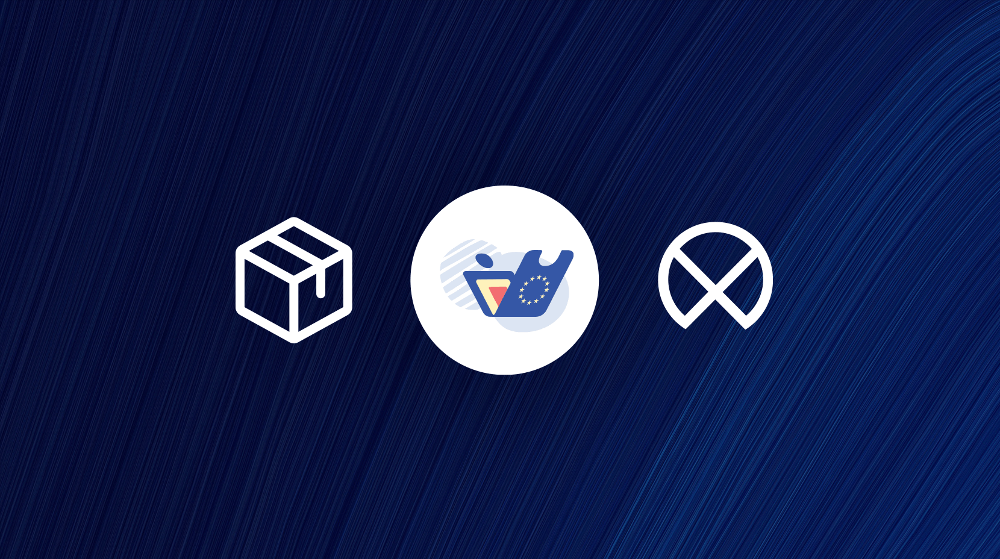

# EUDIW🇪🇺🇱🇻: WebApp

This WebApp powers the core UI and communication layer of the **NOBID [EUDIW](https://ec.europa.eu/digital-building-blocks/sites/display/EUDIGITALIDENTITYWALLET/EU+Digital+Identity+Wallet+Home) Latvia** apps for Android and iOS.
It’s built and bundled directly into the native app sources and runs locally within them.

For development, it can also be run as a standalone web application on local dev server using a mock communication middleware (see [Development](#development) and [Customize configuration](#customize-configuration)).

Built with the [LX/UI platform](https://github.com/wntrtech/lx-ui) and [Vue.js 3](https://vuejs.org) for fast, consistent, and accessible user interfaces.


## Development

1. Build dev server:

    ```bash
    pnpm i
    ```

2. Run dev server (also possible with vs code debug functionality <kbd>F5</kbd>) :

    ```bash
    pnpm dev
    ```

3. Don't forget to make sure you're using latest version of [`@wntr/lx-ui`](https://github.com/wntrtech/lx-ui):
    ```bash
    pnpm i -w @wntr/lx-ui@latest
    ```

## Requirements

- [Node.js](https://nodejs.org/en/) (at least v18.0.0)
- [PNPM](https://pnpm.io/) (at least v7.0.0 )

## Customize configuration

Environment variables are loaded from `.env` files in the root directory. See [Vite Environment Variables and Modes](https://vitejs.dev/guide/env-and-mode.html) for more information.

| Variable | Description | Default on serve (locally) | Default on build |
| --- | --- | --- | --- |
| `SERVICE_URL` | URL of the API service that your application will use | `''` | `'/api'` |
| `ENVIRONMENT` | Environment name | `'development'` | `'production'` |
| `PUBLIC_URL` | Public URL of the application | `'https://localhost:44341/'` | `'./'` |
| `BASE_PATH` | Base path of the application | `'/'` | `'/'` |
| `USE_MOCK_MIDDLEWARE` | Use mock middleware [mocks/middleware.mock.js](./mocks/middleware.mock.js) if value `true` | `false` | always `false` (ignores env value) |
| `IS_EMBED` | Web or embedded mode | `false` | `true` | 

example .env file:

```sh
# SERVICE_URL=https://localhost:43345/api/1.0/
SERVICE_URL=https://lx.example.lv/api/1.0/
ENVIRONMENT=development
PUBLIC_URL=https://localhost:44342/
USE_MOCK_MIDDLEWARE=false
IS_EMBED=false #false == web with mock data
```

## Testing docker image locally

In order to test docker image locally (test if docker image is working as expected) run the following commands:

```bash
docker rmi webapp -f && docker rm webapp -f
pnpm run build
docker build -t webapp .
docker run -p 44342:8080 -e SERVICE_URL=https://lx-dev.example.lv/api/1.0/ -e ENVIRONMENT=development -e PUBLIC_URL=http://localhost:44342/ -e USE_MOCK_MIDDLEWARE=true -e BASE_PATH=/ --name webapp webapp
```

after that you can open browser and go to <http://localhost:44342/> and see if the application is working as expected.

you should remember to comment out .env file in order to see how it works as close to production as possible.

## IMPORTANT NOTES

It's **very important** that the webapp (this portal) can be built and run locally as described below, with no extra steps:

- Clone this repo;
- Add `.env` file to my local project (see above);
- Run `pnpm i`;
- Press **F5** ("Run and Debug" in VSCode);
- Webapp starts in my local browser and can call published Dev API (without any CORS, HTTPS, Authentication redirect and/or other problems);

Other ways to run this webapp (e.g., connecting to locally run API, or connecting to test env, etc) are permitted, of course, but should be considered **additional** methods.